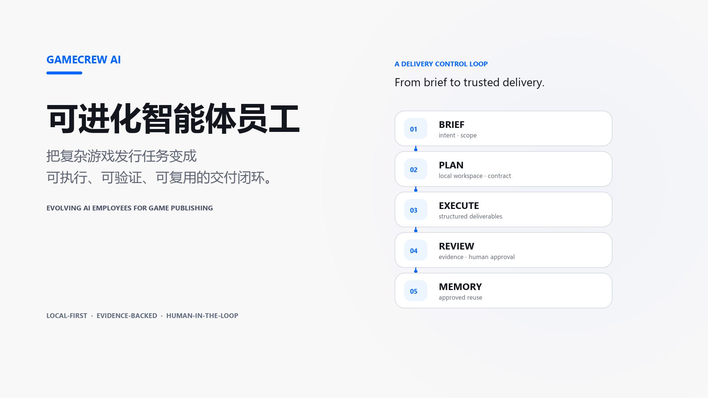

# GameCrew AI｜游戏发行 AI 员工全流程闭环系统

> 一支由向量知识库驱动的游戏发行 AI 战队，负责复杂任务的多 Agent 协调、高质量交付与持续成长。
>
> A vector-memory-powered multi-agent orchestration system for end-to-end game publishing workflows, high-quality delivery and continuously improving AI agents.

## 智能体交付 · Agentic Delivery

GameCrew AI 不止让智能体参与任务，更让专业 AI 员工围绕交付目标完成协作、执行、验证和学习。

GameCrew AI goes beyond agent participation: specialized AI employees coordinate, execute, verify and learn around a shared delivery goal.

### 产品定位

灵犀不是“会聊天的 AI”，而是一套让专业 AI 员工持续完成复杂工作的本地优先运行系统：**可进化智能体员工 + 混合知识 + 证据交付 + 状态化协作 + 人工可控**。

AI 智能体前沿设计规范与能力说明见 [Lingxi Product Positioning](docs/product-positioning.md)。



### Lingxi avatar


The avatar uses two connected blue forms and a central spark to represent collaborative, evolving intelligence. It is supplied as a transparent PNG for GitHub, chat profiles and local workstations.

## 中文介绍

GameCrew AI 是一个本地优先、面向游戏发行的 AI Team OS。它将 AI 员工、专业 Skills、MCP tools、vector knowledge memory、multi-agent orchestration、quality gates 和团队经验整合到一个完整的工作闭环中。

**关键词 / Keywords**：GameCrew AI、game publishing AI、AI employees、multi-agent orchestration、AI agent team、vector knowledge base、MCP、AI workflow、game launch、live operations。

系统关注的不是一次回答得多快，而是复杂游戏发行工作能否持续、稳定、可追踪地完成：

```text
任务目标 → 需求判断 → 知识检索 → 能力预检 → 员工协作
→ 工具调用 → 结构化交付 → 质量验收 → 复盘沉淀
```

### 核心能力

- **游戏发行专用**：覆盖市场、数据、创意、投放、运营、知识和工程等发行环节。
- **向量知识库驱动**：让历史项目、复盘经验和方法规范可检索、可引用、可持续更新。
- **复杂任务多 Agent 协调**：根据交付目标进行角色路由、并行协作和上下游流水线编排。
- **高质量闭环交付**：从需求判断、能力预检到证据验收和结构化交付，全程可追踪。
- **可持续成长智能体**：将有效方法、失败原因和适用边界沉淀为下一次任务可复用的团队记忆。
- **AI 员工化**：按市场、数据、创意、投放、运营、知识和工程等岗位组织专业能力。
- **任务编排化**：支持单员工执行、多员工并行和上下游流水线协作。
- **能力模块化**：统一管理 Skill、MCP、API 和本地工具，并按员工授权。
- **证据化交付**：任务拥有交付契约、执行状态、来源证据和质量检查。
- **失败可恢复**：区分职责、连接、授权、数据和质量问题，提供重试、重路由和保底路径。
- **团队记忆化**：将有效方法、失败原因和适用边界沉淀为可复用知识。
- **本地优先**：使用本地客户端和 SQLite 管理状态，明确数据、权限和外部工具边界。

### 系统由什么组成

```text
AI 员工系统  —— 谁来做
能力系统     —— 用什么做
任务运行时   —— 怎么做、做到哪一步
知识系统     —— 如何越做越好
```

四个系统形成闭环：

```text
岗位 → 能力 → 任务 → 交付 → 复盘 → 新能力
```

## English Introduction

GameCrew AI is a local-first AI Team OS built for game publishing. It combines role-based AI employees, reusable Skills, MCP tools, vector knowledge memory, multi-agent orchestration, quality gates and organizational learning into one closed loop.

Lingxi is designed for reliable knowledge work, not one-off chat answers:

```text
Task goal → Intent → Knowledge → Capability preflight → Agent collaboration
→ Tool execution → Structured delivery → Quality review → Retrospective memory
```

### Core capabilities

- **Built for game publishing** across market strategy, data, creative, growth, operations, knowledge and engineering.
- **Vector knowledge memory** that makes project history, lessons and playbooks searchable, citable and continuously maintainable.
- **Multi-agent coordination for complex work** with role routing, parallel execution and sequential pipelines.
- **High-quality closed-loop delivery** from intent and capability checks to evidence-backed review and structured outputs.
- **Continuously improving agents** that learn from validated methods, failures and applicability boundaries.
- **Role-based AI employees** for strategy, data, creative, growth, operations, knowledge and engineering work.
- **Task orchestration** across direct execution, parallel fan-out and sequential pipelines.
- **Composable capabilities** through governed Skills, MCP servers, APIs and local tools.
- **Evidence-backed delivery** with explicit contracts, execution state, sources and review checks.
- **Bounded recovery** for routing, connection, authorization, data and quality failures.
- **Organizational memory** that turns useful methods and lessons into reusable knowledge.
- **Local-first control** with local runtime state, SQLite persistence and explicit security boundaries.

## Quick start

GameCrew AI 现包含零依赖的参考 Skill 与本地 CLI：把游戏发行 brief 转成可追踪的交付流程。公开 MVP 可校验 brief，并生成可审计的任务账本、角色交接与质量门产物；它不宣称是托管式生产编排服务。

GameCrew AI includes a dependency-free reference Skill and local CLI for turning a game-publishing brief into a traceable delivery workflow. The public MVP validates a brief and writes auditable task, handoff and quality-gate artifacts; it does not claim to be a hosted production orchestration service.

```bash
git clone https://github.com/realxuekun-commits/gamecrew-ai.git
cd gamecrew-ai
node scripts/gamecrew-ai.mjs demo
node scripts/gamecrew-ai.mjs validate examples/launch-brief.json
node scripts/gamecrew-ai.mjs run examples/launch-brief.json --out ./gamecrew-output
node --test tests/gamecrew-ai.test.mjs
```

To load the reusable instructions in Codex, copy or link [`skills/gamecrew-ai`](skills/gamecrew-ai) into your local Skill directory. The CLI has no third-party runtime dependencies.

See [Architecture & Runtime Design](docs/architecture.md) for the bilingual technical overview, [Local Capability Map](docs/local-capability-map.md) for local-only capabilities and fallbacks, and [Maintainer Guide](docs/maintainer-guide.md) for the contribution workflow.

前沿设计模块见 [Frontier Knowledge & Agent Runtime Patterns](docs/frontier-knowledge-agent-runtime.md)：涵盖混合检索、事件/证据账本、状态化任务图、结构化 Agent 交接和评估安全门。

更新记录见 [CHANGELOG.md](CHANGELOG.md)。

### 灵犀核心提示词扩展包

从 [`extensions/lingxi-core-prompts`](extensions/lingxi-core-prompts) 选择策略、创意、增长、运营、知识或工程模块。每个模块都提供可直接复制的 Prompt、输入输出契约、所需能力、权限边界和无三方 fallback；Prompt 不会自动授予内部 Skill、MCP 或数据权限。

### Knowledge Setup Wizard

下载者可以不接入任何第三方服务，按向导在本地搭建知识库：

```bash
node scripts/gamecrew-ai.mjs knowledge init ./knowledge
node scripts/gamecrew-ai.mjs knowledge import ./docs --dir ./knowledge
node scripts/gamecrew-ai.mjs knowledge index --dir ./knowledge
node scripts/gamecrew-ai.mjs knowledge query "海外素材测试" --dir ./knowledge
node scripts/gamecrew-ai.mjs knowledge doctor --dir ./knowledge
```

向导默认使用可复现的离线词法索引；已有向量库或本地 embedding 模型可通过 adapter 接入。详见 [Knowledge Setup Wizard](docs/knowledge-setup.md)。

## Repository scope and security

This public repository contains generalized architecture, documentation and sanitized examples only. Never commit API keys, tokens, cookies, passwords, internal databases, real user data, private network addresses, production logs or confidential business rules.

## Roadmap

- [x] Public demo data and local reference workflow
- [ ] Skill and MCP extension examples
- [x] Frontier knowledge and agent runtime design module
- [x] Local runtime bootstrap
- [x] Task state, handoff and quality-gate schemas
- [x] Local knowledge setup wizard and lexical fallback
- [ ] Community contribution guide

## License

Released under the [MIT License](LICENSE).
